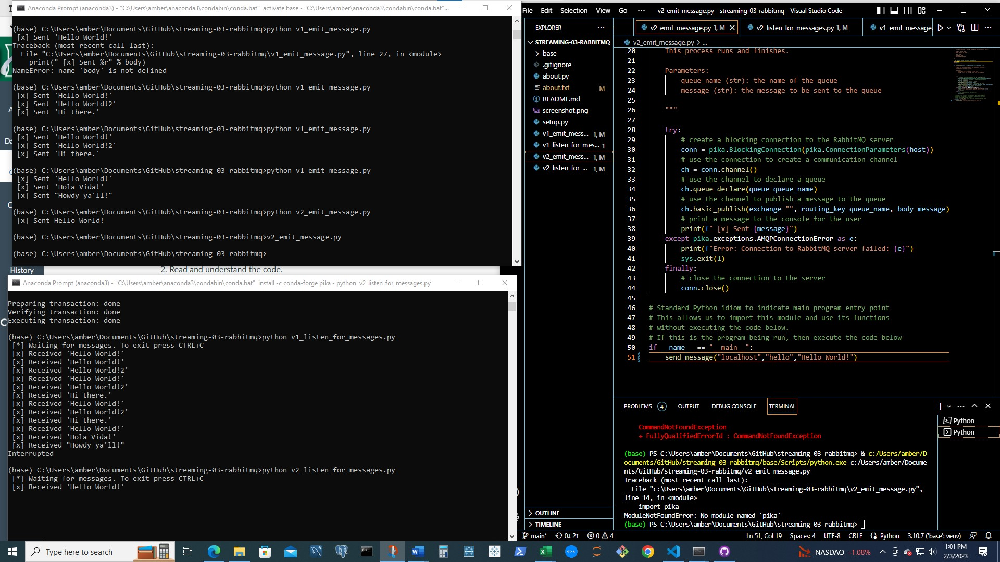

### Amber Speer
## Module 3 Assignment

# streaming-03-rabbitmq

Get started with RabbitMQ, a message broker, that enables multiple processes to communicate reliably through an intermediary

## Before You Begin

1. Fork this starter repo into your GitHub. (Done)
2. Clone your repo down to your machine. (Done)
3. In VS Code with Python extension, click on emit_message_v1.py to get VS Code in Python mode. (Done)
4. View / Command Palette - then Python: Select Interpreter (Done)
5. Select your conda environment. See the references below for more. (Done)
6. Use the terminal to install pika into your active environment. (Done)

`conda install -c conda-forge pika`

## Read

1. Read the [RabbitMQ Tutorial - Hello, World!](https://www.rabbitmq.com/tutorials/tutorial-one-python.html) (Done)
2. Read the code and comments in this repo.

## Execute about,py

1. Run about.py. (Done)
2. Read about.txt. (Done)
3. Verfiy you have exactly one active, one None env. 
    This is working correctly in the Anaconda Prompt terminal

## Version 1 - Execute the Producer/Sender

1. Read v1_emit_message.py (and the tutorial) (Done)
1. Run the file. 

You'll need to fix an error in the program to get it to run.
Once it runs and finishes, we can reuse the terminal.

**I didn't find an error.  I noticed that LocalHost was all capitalized, but it still ran in my terminal.**

## Version 1 - Execute the Consumer/Listener

1. Read v1_listen_for_messages.py (and the tutorial)
1. Run the file.

You'll need to fix an error in the program to get it to run. (LocalHost was misspelled)

Once it runs successfully, will it terminate on its own? How do you know? 
(No, it will not terminate on its own.  This script did not include code to close the connection.)

As long as the process is running, we cannot use this terminal for other commands. 

## Version 1 - Open a New Terminal / Emit More Messages

1. Open a new terminal window. (Done.  The environment and scripts are not runn correctly for me in VS so I am running all the scripts in a seperate terminal.  I think that is the goal, but I had to go straight to that step for some reason.)
2. Use this new window to emit more messages (Done)
3. In v1_emit_message.py, modify the message. (Done)
4. Execute the script. (Done)
5. Watch what happens in the listening window. (Done)
6. Do this several times to emit at least 3 different messages. (Done)

## Version 1: Don't Repeat Yourself (DRY)

1. Did you notice you had to change the message in two places?
    1. You update the actual message sent. 
    2. You also update what is displayed to the user. 
2. Fix this by introducting a variable to hold the message. 
    1. Use your variable when sending. 
    2. Use the variable again when displaying to the user. 

To send a new message, you'll only make one change.
Updating and improving code is called 'refactoring'. 
Use your skills to keep coding enjoyable. 

## Version 2

Now look at the second version of each file.
These include more graceful error handling,
and a consistent, reusable approach to building code.

Each of the version 2 programs include an error as well. 

1. Find the error and fix it. (Done)
2. Compare the structure of the version 2 files. (Done)
3. Modify the docstrings on all your files. (Done)
4. Include your name and the date. (Done)
5. Imports always go at the top, just after the file docstring.
6. Imports should be one per line - why? (For readability)
7. Then, define your functions.
8. Functions are reuable logic blocks.
9. Everything the function needs comes in through the arguments.
10. A function may - or may not - return a value. 
11. When we open a connection, we should close the connection. 
12. Which of the 4 files will always close() the connection? (v2_listen_for_messages.py)
13. Search GitHub for if __name__ == "__main__":
14. How many hits did you get? over 40M code results
15. Learn and understand this common Python idiom. (Done)

## Reference

- [RabbitMQ Tutorial - Hello, World!](https://www.rabbitmq.com/tutorials/tutorial-one-python.html)
- [Using Python environments in VS Code](https://code.visualstudio.com/docs/python/environments)

## Multiple Terminals

